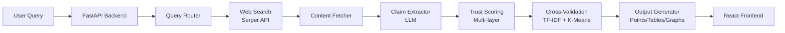

<div align="center">

# 🔍 TrustSight

### AI-Powered Research Assistant

*Research made trustworthy — live web search + credibility scoring + structured outputs*

[](https://github.com/KennyAck001/TrustSight)
[](https://www.python.org/downloads/)
[](https://fastapi.tiangolo.com/)
[](https://reactjs.org/)

[🚀 Quick Start](#-quick-start) • [✨ Features](#-key-features) • [📖 Documentation](#-api-overview) • [🤝 Contributing](#-contributing)

---

</div>

## 🎯 What is TrustSight?

TrustSight is an intelligent research assistant that combines real-time web search with advanced credibility analysis. Unlike traditional LLMs that rely on static training data, TrustSight fetches current information, validates sources, and presents findings in structured formats — all with transparent trust scores.

### 🌟 Why TrustSight?

- **🔴 Problem**: LLMs hallucinate, use outdated data, and lack source transparency
- **🟢 Solution**: Real-time web research + multi-layer trust scoring + cross-validation
- **🎁 Result**: Reliable, current, and verifiable research outputs

---

## ✨ Key Features

<table>
<tr>
<td width="50%">

### 🌐 Real-Time Web Research
Fetches current data from live sources instead of relying on static LLM knowledge. Never worry about outdated information again.

### 🛡️ Multi-Layer Trust Scoring
Evaluates sources using:
- Domain authority & reputation
- Content recency & freshness
- Author credibility
- Structural quality
- Cross-validation with other sources

### 🎯 Cross-Validation Engine
Uses **TF-IDF + K-Means clustering** to:
- Group similar claims
- Detect contradictions
- Compute confidence scores
- Flag inconsistencies

</td>
<td width="50%">

### 📊 Smart Output Formats
Automatically detects query intent and generates:
- **Bullet points** for conceptual questions
- **Tables** for comparisons
- **Graphs** (PNG base64) for data visualization

### ⚡ Dual Mode Intelligence
- **Research Mode**: Deep analysis with citations
- **Conversational Mode**: Quick responses
- Smart routing for optimal accuracy/speed

### 🔧 Fully Customizable
Configure your own:
- Search API providers
- LLM backends (Gemini/OpenAI/custom)
- Trust scoring parameters
- Output preferences

</td>
</tr>
</table>

---

## 🧩 Tech Stack



| Layer | Technology |
|-------|-----------|
| **Frontend** | React 18 + Vite + Tailwind CSS |
| **Backend** | Python 3.8+ + FastAPI + Uvicorn |
| **ML & NLP** | TF-IDF, K-Means, scikit-learn |
| **LLM** | Google Gemini / OpenAI (configurable) |
| **Visualization** | Matplotlib (PNG base64 encoding) |
| **Search** | Serper API (or custom provider) |
| **Web Scraping** | BeautifulSoup4, Newspaper3k |

---

## 🚀 Quick Start

### Prerequisites

- Python 3.8 or higher
- Node.js 16+ and npm
- API keys: [Serper](https://serper.dev/), [Gemini](https://makersuite.google.com/app/apikey), [OpenAI](https://platform.openai.com/) (optional)

### 1️⃣ Clone the Repository

```bash
git clone https://github.com/KennyAck001/TrustSight.git
cd TrustSight
```

### 2️⃣ Backend Setup (FastAPI)

```bash
# Create virtual environment
python -m venv venv

# Activate virtual environment
# Windows:
venv\Scripts\activate
# macOS/Linux:
source venv/bin/activate

# Install dependencies
pip install -r requirements.txt
```

Create a `.env` file in the root directory:

```env
SERPER_API_KEY=your_serper_api_key_here
GEMINI_API_KEY=your_gemini_api_key_here
OPENAI_API_KEY=your_openai_api_key_here  # Optional
```

Start the backend server:

```bash
uvicorn main:app --host 0.0.0.0 --port 8000 --reload
```

Backend will be available at `http://localhost:8000`

### 3️⃣ Frontend Setup (React)

```bash
cd frontend
npm install
npm run dev
```

Frontend will be available at `http://localhost:5173`

### 4️⃣ Test the API

```bash
curl -X POST http://localhost:8000/research \
  -H "Content-Type: application/json" \
  -d '{"query": "What are the benefits of renewable energy?"}'
```

---

## 📖 API Overview

### Core Endpoints

#### `POST /research`

Main research endpoint that returns structured outputs based on query intent.

**Request:**
```json
{
  "query": "Compare Python, Java, and JavaScript in a table"
}
```

**Response Types:**

1. **Points Output** (for conceptual questions):
```json
{
  "points": "- Python is beginner-friendly with clean syntax\n- Java is enterprise-focused with strong typing\n- JavaScript dominates web development",
  "trust_scores": [0.85, 0.82, 0.88],
  "confidence": 0.85
}
```

2. **Table Output** (for comparisons):
```json
{
  "table": [
    {
      "Language": "Python",
      "Use Case": "Data Science, ML",
      "Trust Score": 0.85,
      "Confidence": 0.82
    },
    // ... more rows
  ]
}
```

3. **Graph Output** (for data visualization):
```json
{
  "graph_image_base64": "iVBORw0KGgoAAAANSUhEUg...",
  "explanation": "Graph shows temperature trends from 1900-2024",
  "confidence": 0.79
}
```

#### `POST /approve_source`

Manually approve a source to boost its trust score.

```json
{
  "source": "https://example.com/article"
}
```

#### `POST /flag_source`

Flag a source as unreliable to reduce its trust score.

```json
{
  "source": "https://unreliable-site.com/article"
}
```

---

## 💡 Example Queries

<table>
<tr>
<th>Output Type</th>
<th>Example Query</th>
</tr>
<tr>
<td><b>Points</b></td>
<td>
  
• What are the benefits of renewable energy?<br/>
• Explain quantum computing concepts<br/>
• List advantages of electric vehicles

</td>
</tr>
<tr>
<td><b>Table</b></td>
<td>

• Compare Python, Java, and JavaScript<br/>
• Show differences between SQL and NoSQL<br/>
• Compare cloud providers (AWS, Azure, GCP)

</td>
</tr>
<tr>
<td><b>Graph</b></td>
<td>

• Show global temperature changes over time<br/>
• Graph cryptocurrency price trends<br/>
• Visualize CO2 emissions by country

</td>
</tr>
</table>

---

## 🧠 Core Modules

```
TrustSight/
├── main.py                 # FastAPI application entry point
├── search.py               # Web search integration (Serper API)
├── fetcher.py              # Async content download & cleanup
├── claims.py               # LLM-based claim extraction
├── trust_scoring.py        # Multi-layer trust scoring engine
├── cve.py                  # Cross-Validation Engine (TF-IDF + K-Means)
├── graph_generator.py      # Matplotlib visualization (base64 PNG)
├── query_router.py         # Research vs. conversational mode routing
└── frontend/               # React UI
```

### Module Deep Dive

**`trust_scoring.py`** - Calculates trust scores using:
- Domain reputation (`.edu`, `.gov` > commercial)
- Content recency (newer = higher score)
- Author credentials (verified experts)
- Cross-reference count (cited by others)
- Structural quality (proper citations, formatting)

**`cve.py`** - Cross-Validation Engine:
1. Extracts claims from all sources
2. Vectorizes using TF-IDF
3. Clusters similar claims with K-Means
4. Identifies contradictions
5. Computes aggregate confidence scores

**`graph_generator.py`** - Creates visualizations:
- Line charts for trends
- Bar charts for comparisons
- Scatter plots for correlations
- Encodes as base64 PNG for easy embedding

---

## 🔧 Configuration

Edit `config.py` to customize:

```python
# Search settings
MAX_SEARCH_RESULTS = 10
SEARCH_TIMEOUT = 30

# Trust scoring weights
DOMAIN_WEIGHT = 0.3
RECENCY_WEIGHT = 0.2
AUTHOR_WEIGHT = 0.2
STRUCTURE_WEIGHT = 0.15
CROSS_VAL_WEIGHT = 0.15

# LLM settings
DEFAULT_LLM = "gemini"  # or "openai"
MAX_TOKENS = 2000
TEMPERATURE = 0.3

# Output preferences
DEFAULT_OUTPUT_FORMAT = "auto"  # auto, points, table, graph
```

---

## 🤝 Contributing

We welcome contributions! Here's how to get started:

### Development Workflow

1. **Fork the repository**
   ```bash
   gh repo fork KennyAck001/TrustSight
   ```

2. **Create a feature branch**
   ```bash
   git checkout -b feature/amazing-feature
   ```

3. **Make your changes**
   - Follow PEP 8 for Python code
   - Use ESLint/Prettier for JavaScript
   - Add tests for new features

4. **Commit with descriptive messages**
   ```bash
   git commit -m "Add: Multi-source aggregation feature"
   ```

5. **Push and create a Pull Request**
   ```bash
   git push origin feature/amazing-feature
   ```

### Areas We Need Help

- [ ] Additional search API integrations (DuckDuckGo, Bing)
- [ ] More visualization types (pie charts, heatmaps)
- [ ] Enhanced NLP models for claim extraction
- [ ] UI/UX improvements
- [ ] Documentation and tutorials
- [ ] Test coverage expansion

---

## 📊 Project Status

- [x] Core research pipeline
- [x] Trust scoring engine
- [x] Cross-validation system
- [x] Multiple output formats
- [x] React frontend
- [ ] User authentication
- [ ] Research history/bookmarks
- [ ] Export to PDF/Markdown
- [ ] Browser extension
- [ ] Mobile app

---

## 🏆 Built By

<table>
<tr>
<td align="center">
<a href="https://github.com/KennyAck001"></a><br />
<b>Ayush</b><br />
<sub>Project Lead</sub><br />
<a href="https://github.com/KennyAck001">@KennyAck001</a>
</td>
<td align="center">
<a href="https://github.com/atharv-sonawane128"></a><br />
<b>Atharv Sonawane</b><br />
<sub>Backend & Research</sub><br />
<a href="https://github.com/atharv-sonawane128">@atharv-sonawane128</a>
</td>
<td align="center">
<a href="https://github.com/Rishita2518"></a><br />
<b>Rishita</b><br />
<sub>Frontend & UX</sub><br />
<a href="https://github.com/Rishita2518">@Rishita2518</a>
</td>
<td align="center">
<a href="https://github.com/Sourabh-kumar88"></a><br />
<b>Sourabh Kumar</b><br />
<sub>Machine Learning</sub><br />
<a href="https://github.com/Sourabh-kumar88">@Sourabh-kumar88</a>
</td>
</tr>
</table>

### 🎓 Acknowledgments

Built with ❤️ during **Devi@Thon 2025** at GLA University, Mathura.

Special thanks to:
- FastAPI team for the amazing framework
- Google for Gemini API access
- Serper for reliable search API
- Open source community

---

## 🔗 Links

- **GitHub**: [github.com/KennyAck001/TrustSight](https://github.com/KennyAck001/TrustSight)
- **Documentation**: [docs.trustsight.dev](https://docs.trustsight.dev) (coming soon)
- **Demo**: [demo.trustsight.dev](https://demo.trustsight.dev) (coming soon)
- **Issues**: [Report a bug or request a feature](https://github.com/KennyAck001/TrustSight/issues)

---

## 📞 Contact

**Ayush** - [@KennyAck001](https://github.com/KennyAck001)

Project Link: [https://github.com/KennyAck001/TrustSight](https://github.com/KennyAck001/TrustSight)

---

<div align="center">

### ⭐ Star us on GitHub if you find this project useful!

Made with 💜 by the TrustSight team

</div>